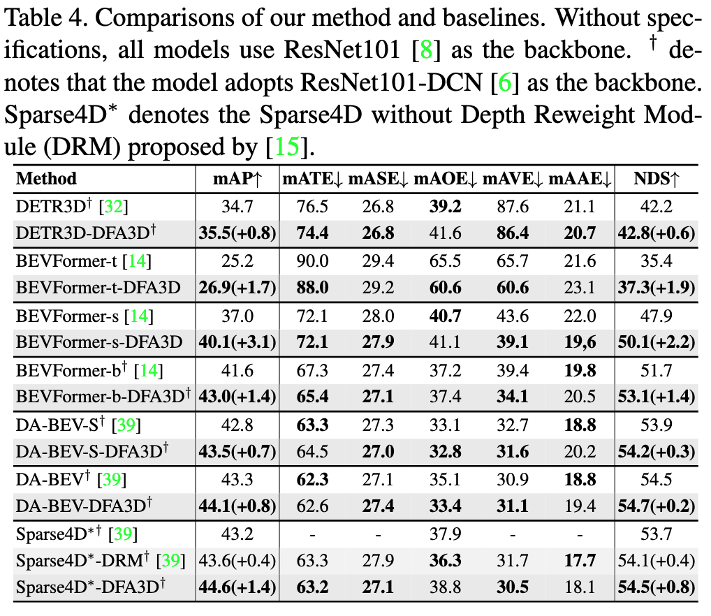

3D Deformable Attention (DFA3D)
========
By [Hongyang Li*](https://scholar.google.com.hk/citations?view_op=list_works&hl=zh-CN&user=zdgHNmkAAAAJ&gmla=AMpAcmTJNHoetv6zgfzZkIRcYsFr0UkGGDyl5tAp5etuBqhz3lzYZCQrVDot02xVQ1XTbnMS1fPdAfe0-2--aTXOtewokjyShNLOQQyyhtkolwaz0hvENZpi-pJ-Wg), [Hao Zhang*](https://scholar.google.com/citations?user=B8hPxMQAAAAJ&hl=zh-CN), [Zhaoyang Zeng](https://scholar.google.com.hk/citations?user=U_cvvUwAAAAJ&hl=zh-CN&oi=sra), [Shilong Liu](https://scholar.google.com/citations?hl=zh-CN&user=nkSVY3MAAAAJ), [Feng Li](https://scholar.google.com.hk/citations?user=ybRe9GcAAAAJ&hl=zh-CN&oi=sra), [Tianhe Ren](https://scholar.google.com.hk/citations?user=cW4ILs0AAAAJ&hl=zh-CN&oi=sra), and [Lei Zhang](https://scholar.google.com/citations?hl=zh-CN&user=fIlGZToAAAAJ) <sup>:email:</sup>.

[[`Paper`](https://arxiv.org/abs/2307.12972)] [[`BibTex`](#black_nib-citation)]

This repository is the official implementation of the paper "DFA3D: 3D Deformable Attention For 2D-to-3D Feature Lifting".

# :fire: News
[2023/7/15] Our paper is accepted by ICCV2023.

[2023/8/24] We opensource our 3D Deformable Attention (DFA3D) and also DFA3D-enabled BEVFormer.


# :scroll: Abstract
In this paper, we propose a new operator, called 3D DeFormable Attention (DFA3D), for 2D-to-3D feature lifting, which transforms multi-view 2D image features into a unified 3D space for 3D object detection. 
Existing feature lifting approaches, such as Lift-Splat-based and 2D attention-based, either use estimated depth to get pseudo LiDAR features and then splat them to a 3D space, which is a one-pass operation without feature refinement, or ignore depth and lift features by 2D attention mechanisms, which achieve finer semantics while suffering from a depth ambiguity problem. 
In contrast, our DFA3D-based method first leverages the estimated depth to expand each view's 2D feature map to 3D and then utilizes DFA3D to aggregate features from the expanded 3D feature maps. With the help of DFA3D, the depth ambiguity problem can be effectively alleviated from the root, and the lifted features can be progressively refined layer by layer, thanks to the Transformer-like architecture. In addition, we propose a mathematically equivalent implementation of DFA3D which can significantly improve its memory efficiency and computational speed. We integrate DFA3D into several methods that use 2D attention-based feature lifting with only a few modifications in code and evaluate on the nuScenes dataset. The experiment results show a consistent improvement of +1.41 mAP on average, and up to +15.1 mAP improvement when high-quality depth information is available, demonstrating the superiority, applicability, and huge potential of DFA3D.

# :hammer_and_wrench: Method
## Comparison of feature lifting methods.


## Improvements.
Our DFA3D brings consistent improvement on several methods, including two concurrent works ([DA-BEV](https://arxiv.org/abs/2302.13002)  and [Sparse4D](https://arxiv.org/abs/2211.10581)).



Improving the quality of depth will bring further gains (up to 15.1% mAP).


## How to transform your 2D Attention-based feature lifting into our 3D Deformable Attention-based one.
Here, we take 2D Deformable Attention as an example, only a few modifications in code are required. For more details, please refer to our examples provided in Model Zoo. 

For more details, please refer to our provided DFA3D-enabled BEVFormer.


# :rocket: Model Zoo
We denote 2D Deformable Attention and our 3D Deformable Attention as DFA2D and DFA3D respectively.
<table>
  <thead>
    <tr style="text-align: right;">
      <th></th>
      <th>Method</th>
      <th>Feature Lifting</th>
      <th>mAP&nbsp/&nbspNDS</th>
      <th>Config</th>
      <th>Checkpoint</th>
    </tr>
  </thead>
  
  <tbody>
    <tr>
      <th rowspan="2">0</th>
      <td rowspan="2">BEVFormer-base</td>
      <td>DFA2D-based</td>
      <td>41.6&nbsp/&nbsp51.7</td>
      <td><a href="https://github.com/fundamentalvision/BEVFormer/tree/master#model-zoo">config</a></td>
      <td><a href="https://github.com/fundamentalvision/BEVFormer/tree/master#model-zoo">model</a></td>
    </tr>
    <tr>
      <td>DFA3D-based</td>
      <td>43.2&nbsp/&nbsp53.2 <br>+1.6&nbsp/&nbsp+1.5</td>
      <td><a href="https://github.com/IDEA-Research/3D-deformable-attention/blob/main/BEVFormer_DFA3D/projects/configs/bevformer/bevformer_base_DFA3D.py">config</a></td>
      <td><a href="https://drive.google.com/file/d/1hWeNBnBYNkO1UDQTbR8zuozMRCFPx1h-/view?usp=sharing">model</a></td>
    </tr>
    <tr>
      <th rowspan="2">1</th>
      <td rowspan="2">BEVFormer-small</td>
      <td>DFA2D-based</td>
      <td>37.0&nbsp/&nbsp47.9</td>
      <td><a href="https://github.com/fundamentalvision/BEVFormer/tree/master#model-zoo">config</a></td>
      <td><a href="https://github.com/fundamentalvision/BEVFormer/tree/master#model-zoo">model</a></td>
    </tr>
    <tr>
      <td>DFA3D-based</td>
      <td>40.3&nbsp/&nbsp50.9<br>+3.3&nbsp/&nbsp+3.0</td>
      <td><a href="https://github.com/IDEA-Research/3D-deformable-attention/blob/main/BEVFormer_DFA3D/projects/configs/bevformer/bevformer_small_DFA3D.py">config</a></td>
      <td><a href="https://drive.google.com/file/d/1wGFMSDDAU5cZ02KxYWIs_47xRel1694A/view?usp=sharing">model</a></td>
    </tr>
    <tr>
      <th rowspan="2">2</th>
      <td rowspan="2">BEVFormer-base-GTDepth</td>
      <td>DFA2D-based</td>
      <td>-&nbsp/&nbsp-</td>
      <td>-</td>
      <td>-</td>
    </tr>
    <tr>
      <td>DFA3D-based</td>
      <td>57.6&nbsp/&nbsp63.6 <br>+16.0&nbsp/&nbsp+11.9</td>
      <td><a href="https://github.com/IDEA-Research/3D-deformable-attention/blob/main/BEVFormer_DFA3D/projects/configs/bevformer/bevformer_base_DFA3D_GTDpt.py">config</a></td>
      <td><a href="https://drive.google.com/file/d/1my_K-s2G0Pt4zqWAV0t6WvznXTvM8G6r/view?usp=share_link">model</a></td>
    </tr>
  </tbody>
</table>

# :gear: Usage
We develop our 3D Deformable Attention based on mmcv. We test our method under ```python=3.8.13,pytorch=1.9.1,cuda=11.1```. Other versions might be available as well.
## Installation
1. Clone this repo.
```sh
git clone https://github.com/IDEA-Research/3D-deformable-attention.git
cd 3D-deformable-attention/
```
2. Install Pytorch and torchvision.

Follow the instructions at https://pytorch.org/get-started/locally/.
```sh
# an example:
conda install -c pytorch pytorch torchvision
```

3. Compile and install 3D-Deformable-Attention.
```sh
cd DFA3D
bash setup.sh 0
# check if it is installed correctly.
cd ../
python unittest_DFA3D.py
```
## Run

### Prepare datasets
Construct the dataset as in [BEVFormer](https://github.com/fundamentalvision/BEVFormer/blob/master/docs/prepare_dataset.md). And download our prepared [depth map](https://drive.google.com/file/d/1C0lYFU1Wu2fVOjC-YcUBThS5rf4ehieR/view?usp=share_link) (obtained by projecting single sweep lidar points on to the multi-view images), and unzip it at 
```
./data/nuscenes/depth_gt/
```
### Eval our pretrianed models
Download our provided checkpoints in Model Zoo.
```sh
cd BEVFormer_DFA3D
bash tools/dist_test.sh path_to_config  path_to_checkpoint 1
# an example: 
bash tools/dist_test.sh ./projects/configs/bevformer/bevformer_base_DFA3D_GTDpt.py ./ckpt/bevformer_base_DFA3D_gtdpt.pth 1
```
### Train the models
```sh
bash ./tools/dist_train.sh path_to_config 8
# an example
bash ./tools/dist_train.sh ./projects/configs/bevformer/bevformer_base_DFA3D_GTDpt.py 8
```
# :black_nib: Citation
```
@inproceedings{
  title={DFA3D: 3D Deformable Attention For 2D-to-3D Feature Lifting},
  author={Hongyang Li and Hao Zhang and Zhaoyang Zeng and Shilong Liu and Feng Li and Tianhe Ren and Lei Zhang},
  booktitle={Proceedings of the IEEE/CVF international conference on computer vision},
  year={2023}
}
```
